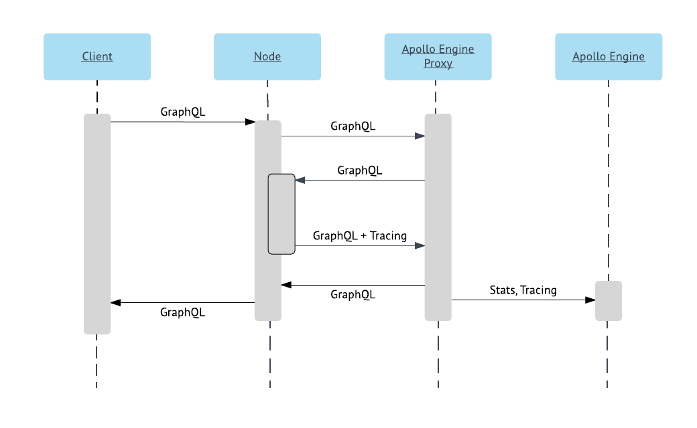

# Apollo Engine

[](https://badge.fury.io/js/apollo-engine)
[](https://travis-ci.org/apollographql/apollo-engine-js)

This package integrates the Apollo Engine proxy with your GraphQL server.

When installed, it starts the Apollo Engine proxy in a new process, then routes
GraphQL requests through that proxy:



# Usage
```js
import { Engine } from 'apollo-engine';

// create new engine instance from JS config object
const engine = new Engine({ engineConfig: { ... } });

// create new engine instance from file
const engine = new Engine({ engineConfig: 'path/to/config.json' });

await engine.start();
app.use(engine.expressMiddleware());

// ...
// other middleware / handlers
// ...
```

To shut down engine
```js
engine.stop();
```

The graphql server should have tracing enabled if available. If you are using Apollo Server (v1.1.0 or newer), enable the tracing: true configuration option.

# Minimum Engine Configuration
This is the minimum necessary information in the engine configuration object to enable sending tracing and telemetry information.

```json
{
  "apiKey": "service:xxxxxxxxxxxxxxxxxxxxxxxxxxxxxxxxxxxxxxx"
}
```

# Full Engine Configuration
The following is a sample configuration showing all the available keys and their default values.
For more information, see the documentation section on [configuring the proxy](http://engine-docs.apollographql.com/setup-node.html)
```json
{
  "apiKey": "service:xxxxxxxxxxxxxxxxxxxxxxxxxxxxxxxxxxxxxxx",
  "logcfg": {
    "level": "DEBUG"
  },
  "origins": [
    {
      "url": "http://localhost:3000/graphql"
    }
  ],
  "frontends": [
    {
      "host": "127.0.0.1",
      "port": 3001,
      "endpoint": "/graphql"
    }
  ],
  "reporting": {
    "debugReports": false,
  },
  "sessionAuth": {
    "store": "standardCache",
    "header": "X-AUTH-TOKEN",
    "tokenAuthUrl": "http://session-server.com/auth-path"
  }
}
```

# Configuring auth sessions
In order to ascertain a user's eligibility to access their session cache, an endpoint on the origin server needs to be able to respond to that effect. 

- `config.sessionAuth`
  - `.header` describes the header that should contain the session token
  - `.tokenAuthUrl` describes the endpoint name on the origin server which should receive the token in the POST body and respond with:
    - `200 OK` and JSON body `{ "ttl": 3000 }` when the token is valid
    - `403 Forbidden` if not
